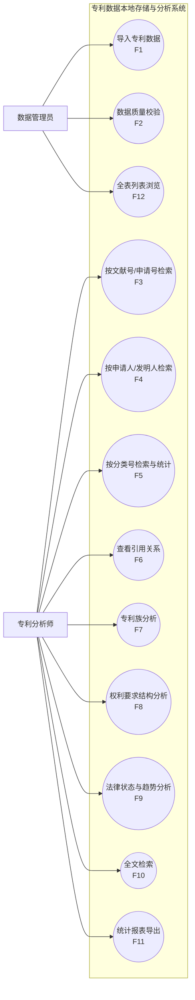
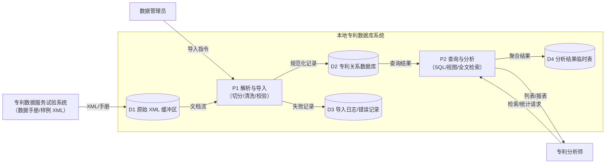
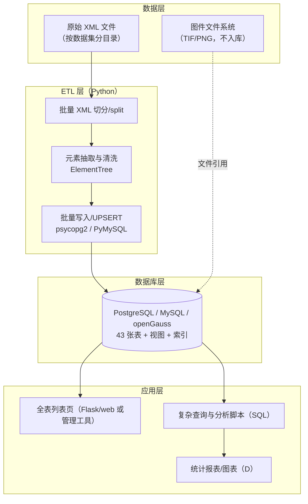

# 05 · 方案设计初稿（A角色，对应报告模板“方案设计”章 ER 相关内容初稿）

> 本章给出总体设计路线、用例图、数据流图、系统框图与 ER 设计要点；详细的实体属性、联系清单、3NF 论证见 `02`/`03`/`04` 号文档。

## 1. 总体设计思路（路线图）

```
需求分析（本角色）
   │  专利数据特点（多值/长文本/自引用/族/多语言）+ 课程约束（≥20表/3NF/键外键）
   ▼
概念设计：E/R 模型（本角色，按教材第4章）
   │  实体集/联系集/弱实体集/ISA；联系清单 R01–R45；E/R 图（04-ER图.md，教材符号）
   ▼
逻辑设计：关系模式（本角色初稿 → B 定稿，按教材4.4/4.6）
   │  强实体集→关系；弱实体集→含属主键关系；M:N→独立关系；多对一→并入多端；
   │  ISA→E/R方式子类表；再用函数依赖/闭包做 BCNF/3NF/4NF 检查（教材第3章，见 03 §4）
   ▼
物理设计：DBMS 选型与类型（B）
   │  PostgreSQL/MySQL/openGauss；BIGINT 代理键；TEXT/LONGTEXT；索引与分区策略
   ▼
实现与验证（B/C）
   │  CREATE TABLE + 约束 + 索引；XML 解析导入脚本；冒烟测试/复杂查询/性能调优
   ▼
应用与成果（C/D）
   │  全表列表前端；分析查询（申请人排名/分类分布/引用热度/时间趋势）；报告与 PPT
```

**设计原则**：①标准驱动（INID/ST.3/ST.16/ST.36）；②标准维表化、业务表只存代码；③关联表承载联系属性；④长文本与大宽表分离；⑤可移植 SQL（避免方言特性，必要处给两种写法）。

## 2. 用例图（Mermaid）



**用例说明（关键 3 个）**
- **UC6 查看引用关系**：输入专利号/文献号 → 正向引用（该专利引用了谁）、反向引用（谁引用了该专利）；按 `citn_origin`（审查员/申请人）与 `citation_category`（X/Y/A…）过滤；被引不在库时展示外部号码。
- **UC7 专利族分析**：输入任一成员 → 输出同族全部成员（国别、法律状态）、族规模、代表文献；支持族级引用网络（`family_citation`）。
- **UC9 法律状态与趋势**：按事件码/时间聚合，输出授权率、失效分布、申请量年度趋势。

## 3. 数据流图（Mermaid，0/1 层合并）



## 4. 系统框图（部署与实现，供 D 画总体框图参考）



## 5. ER 设计要点摘要

1. **三层核心**：`patent`（申请案）—`publication`（公布/公告文献）—文献部件（`title`/`abstract`/`claim`/`drawing`/`description_section`弱实体）；引用出现 `patent_citation` 亦由 publication 识别。
2. **人员实体 + ISA 子类**：`person`（超类）与 `natural_person`/`organization`（教材 4.1.11，转换按 4.6.1 E/R 方式）+ 5 张角色关联表。
3. **分类**：`classification_scheme` → `classification`（符号自身属性）→ `patent_classification`（专利×分类号联系属性），满足 3NF。
4. **引用**：`patent_citation.citing_publication_id` 定位引用清单所属文献，citing/cited patent 表达递归联系；被引在库外时保留原号码；类别和 NPL 分表扩展。
5. **族**：`patent_family` + `patent_family_member` 弱实体 + 成员的 application/publication reference 两张弱实体表 + `family_abstract`；`family_citation` 表达族递归引用。
6. **程序关系**：`priority_claim`（INID 30–34）、`related_application`（INID 61–66）、`international_application`（INID 85/86/87/96/97）均为自引用/弱实体。
7. **规则与标准**：维表承载 ST.3/ST.16/ST.9/ISO 639 代码；法律状态用 `legal_event_code` 字典 + 事件表。
8. **派生数据**：`filing_year`、`granted`、计数类不落列，用视图（`v_patent_granted` 等，见 03 §5）。

## 6. 方案边界与局限（如实声明）

| # | 局限 | 原因 | 影响与应对 |
|---|---|---|---|
| 1 | ~~官网数据手册/样例未获取~~ **已解决**：组员下载四类手册与样例 | patdata 需人工访问 | 已按手册与样例完成 20 项核对修订（`02` §8），字段名与元素路径有官网依据 |
| 2 | ~~未验证真实 EP 全文 XML 结构~~ **已验证** | EPO 页面 403 | EP 全文（B 系列元素）与 DOCDB（exchange-documents v2.5.7）样例均已解析，结论见 `sources/XML结构解析报告.md` §8 |
| 3 | 图件不落库 | 大对象入库成本高 | 只存 `drawing.image_file` 引用，文件系统存图 |
| 4 | 更正文献（INID 15/48）、SPC（68/98）、序列表 | 不在四类数据范围/样例未见 | 标注边界外；如需扩展可加表 |
| 5 | 分析型需求仅给 SQL 方向 | 属 C/D 阶段 | `03` §5 已列视图建议 |
| 6 | 规模估计仅为量级估算 | 四份手册没有给出完整历史总行数 | B 用实际选定年份样本统计后再定分区/索引，不把预估写成官方数字 |

## 7. 待确认问题（与全组讨论）

见 `91-待全组讨论确认清单.md`：数据库选型、增强表范围、日期精度、DOCDB Delete 语义、EP 多语言权利要求、B240 多日期、IPC 双版本、受控冗余与 ISA 完整性。

## 8. 后续阶段衔接

| 交接 | 内容 | 检查点 |
|---|---|---|
| A → 全组 → B | 实体清单、数据字典 CSV、R01–R45联系清单、43 表关系模式预览、教材符号 E/R 图 | 引用源文献、族成员多号码/族摘要、多语言权利要求均已覆盖 |
| B | 43 张表 CREATE TABLE + 约束 + 索引；XML 解析导入脚本 | 表数 ≥20；外键与 ER 转换一致；BCNF/3NF 判定见 03 §4 |
| C | 冒烟测试、复杂查询、完整性验证、性能调优、前端列表 | 引用自引用/族/权利要求查询可用 |
| D | 报告整合、PPT、流程图/伪代码/框图、分析挖掘 | 术语与本文件一致 |
